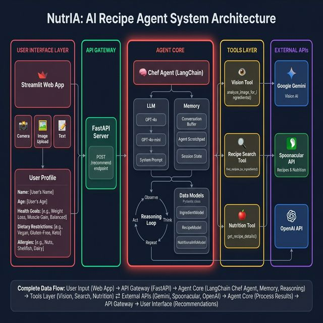

# 🥗 NutrIA: Agente de Nutrición Inteligente

## 📝 Resumen Ejecutivo

**NutrIA** es un asistente de nutrición avanzada impulsado por **IA Agéntica**. Desarrollado con **LangChain**, este sistema ejecuta acciones autónomas como identificar ingredientes mediante visión artificial (Google Gemini), validar restricciones dietéticas según perfiles clínicos y conectar con APIs externas para generar recetas personalizadas con información nutricional completa.

---

## 🏗️ Arquitectura del Sistema

<p align="center">
  
</p>

---

## 📂 Estructura del Proyecto

```
proy_nutria/
├── main.py                    # Entry point - FastAPI server
├── requirements.txt           # Dependencies (pinned versions)
├── Dockerfile                 # Container config
│
├── configs/
│   └── .env                   # API Keys (OPENAI, GEMINI, SPOONACULAR)
│
├── src/
│   ├── agents/
│   │   └── chef_agent.py      # 🤖 Main LangChain Agent
│   │
│   ├── api/
│   │   └── app.py             # 🔌 FastAPI endpoints
│   │
│   ├── frontend/
│   │   └── app.py             # 📱 Streamlit Web UI
│   │
│   ├── models/
│   │   └── schemas.py         # 📦 Pydantic models
│   │
│   ├── prompts/
│   │   └── chef_prompt.py     # 📝 System prompts
│   │
│   ├── tools/
│   │   ├── vision.py          # 👁️ Image analysis (Gemini)
│   │   └── nutrition.py       # 🍎 Recipe & nutrition (Spoonacular)
│   │
│   └── utils/
│       └── helpers.py         # 🔧 Utility functions
│
├── docs/
│   └── agent_architecture.drawio  # 📊 Architecture diagram
│
└── tests/
    ├── unit/
    │   └── test_models.py
    └── integration/
```

---

## 🔧 Tools (Herramientas del Agente)

| Tool | Archivo | Función | API Externa |
|------|---------|---------|-------------|
| **Vision Tool** | `src/tools/vision.py` | `analyze_image_for_ingredients()` | Google Gemini 1.5 Flash |
| **Recipe Search** | `src/tools/nutrition.py` | `find_recipes_by_ingredients()` | Spoonacular |
| **Nutrition Info** | `src/tools/nutrition.py` | `get_recipe_details()` | Spoonacular |

---

## ⚙️ Configuración

### 1. Clonar el repositorio
```bash
git clone https://github.com/PabloJGD/proy_nutria.git
cd proy_nutria
```

### 2. Crear entorno virtual
```bash
python3 -m venv .venv
source .venv/bin/activate  # Linux/Mac
# .venv\Scripts\activate   # Windows
```

### 3. Instalar dependencias
```bash
pip install -r requirements.txt
```

### 4. Configurar variables de entorno
Edita `configs/.env` con tus API keys:

```env
# LLM APIs
OPENAI_API_KEY=sk-proj-...
GOOGLE_STUDIO_AI_API_KEY=AIzaSy...

# Nutrition API
SPOONACULAR_API_KEY=eef177...

# Optional
TAVILY_API_KEY=tvly-dev-...
LANGGRAPH_API_KEY=lsv2_pt_...
```

---

## 🚀 Ejecución

### Iniciar Backend (API)
```bash
uvicorn main:app --reload --host 0.0.0.0 --port 8000
```
La API estará disponible en: `http://localhost:8000`  
Documentación interactiva: `http://localhost:8000/docs`

### Iniciar Frontend (Streamlit)
En otra terminal:
```bash
streamlit run src/frontend/app.py
```
La interfaz estará disponible en: `http://localhost:8501`

---

## 📱 Uso

1. Abre `http://localhost:8501` en tu navegador
2. **Configura tu perfil** en el sidebar:
   - Nombre y edad
   - Objetivos de salud (perder peso, ganar músculo)
   - Restricciones dietéticas (Vegano, Sin Gluten, Keto, etc.)
   - Alergias
3. **Añade ingredientes** mediante:
   - 📷 **Cámara**: Toma una foto de tus ingredientes
   - 🖼️ **Upload**: Sube una imagen existente
   - ✏️ **Texto**: Escribe la lista manualmente
4. Haz clic en **"🔍 Find Recipes"**
5. Recibe recomendaciones personalizadas con:
   - Nombre del plato
   - Por qué se ajusta a tu perfil
   - Información nutricional (Calorías, Proteínas, Carbohidratos, Grasas)
   - Instrucciones de preparación

---

## 🧪 Tests

```bash
# Ejecutar tests unitarios
pytest tests/unit/

# Ejecutar todos los tests
pytest
```

---

## 🐳 Docker

```bash
# Construir imagen
docker build -t nutria-agent .

# Ejecutar contenedor
docker run -p 8000:8000 --env-file configs/.env nutria-agent
```

---

## 💰 Costos (Estrategia $0)

| Componente | Servicio | Costo |
|------------|----------|-------|
| LLM Vision | Google Gemini 1.5 Flash | Free Tier |
| LLM Agent | OpenAI GPT-4o | Pay-per-use |
| Recetas | Spoonacular | Free Tier (150 req/día) |
| Orquestación | LangChain | Open Source |
| Frontend | Streamlit | Open Source |
| Hosting | Streamlit Cloud / Vercel | Free Tier |

---

## 🚀 Roadmap

- [ ] **RAG Integration**: Base de datos vectorial con guías OMS
- [ ] **MCP Protocol**: Conexión con dispositivos IoT
- [ ] **Multi-idioma**: Soporte para español completo
- [ ] **PWA**: Aplicación móvil progresiva
- [ ] **Auth**: Sistema de usuarios y persistencia de perfiles

---

## 📄 Licencia

MIT License - Ver [LICENSE](LICENSE) para más detalles.

---

## 👥 Contribuidores

- **Pablo Guizado** - Desarrollador Principal

---

<p align="center">
  <b>🍳 NutrIA - Tu Chef Personal con Inteligencia Artificial</b>
</p>